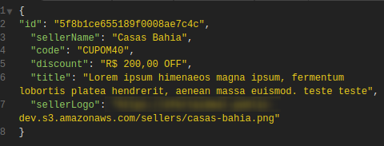
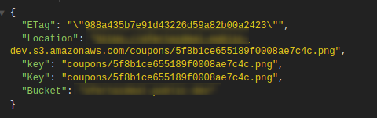

# API de criação de imagens

Endpoint request:

Objeto para requisição:

```json
{
	"id": "5f8b1ce655189f0008ae7c4c",
	"sellerName": "Loja",
	"code": "1P45FGD00054",
	"discount": "16% OFF",
	"title": "Compre eletrodomésticos com 16% de economia",
	"sellerLogo": "https://..."
}
```

Recursos:

- canvas;
- Express JS (heroku);
- dotenv (variáveis de ambiente)

O que ele faz ?

Por uma requisição POST, o objeto acima é recebido, e baseado nas variáveis ele é tratado em uma imagem de um cupom de desconto, que será mandado para os usuários cadastrados.

POST https://....herokuapp.com/coupons/create-image/

### Request


### Response:


<br/>

### Result:
